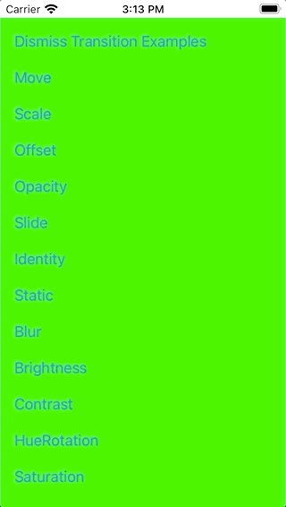

[](https://travis-ci.com/indieSoftware/NavigationStack)
[](https://codecov.io/gh/indieSoftware/NavigationStack)
[](https://indiesoftware.github.io/NavigationStack)
[](https://github.com/indieSoftware/NavigationStack/blob/master/LICENSE)
[](https://github.com/indieSoftware/NavigationStack)
[](https://cocoapods.org/pods/SwiftUINavigationStack)

[GitHub Page](https://github.com/indieSoftware/NavigationStack)

# NavigationStack for SwiftUI

NavigationStack is a custom SwiftUI solution for navigating between views. It's a more flexible alternative to SwiftUI's own navigation.

## Advantages 

Compared to SwiftUI's `NavigationView` / `NavigationLink` and the `.sheet`-Modifier:

- Use different transition animations (not only a horizontal push/pop or a vertical present/dismiss)
- Use one of the various transition animations included
- Or create your own custom transition animations
- Navigate even without any transition animation at all if you want
- Define the back transition animation right before transitioning back, not in advance when transitioning forward
- Navigate back multiple screens at once, not only to the previous
- Use a full-screen present transition also on iOS 13

### Transition Examples

Use SwiftUI's default transitions:


Or use some default view animations for transitioning:


Or write your own custom transitions:



## Installation

### CocoaPods

To include this lib via [CocoaPods](https://cocoapods.org) into your project, simply add to your pod file:

```
pod 'NavStack'
```

## Usage

1. Import the lib to your view's source file.
2. Include the `NavigationModel` to your view as an environment object.
3. Use the `NavigationStackView` as a root stack view of your view and give it a unique name to reference it.
4. Use the `NavigationModel` object to perform any transitions, i.e. a push or pop. Provide the `NavigationStackView`'s name to define which `NavigationStackView` in the hierachy should switch its content.

```
import NavigationStack

struct MyRootView: View {
	@EnvironmentObject var navigationModel: NavigationModel

	var body: some View {
		NavigationStackView("MyRootView") {
			Button(action: {
				navigationModel.pushContent("MyRootView") {
					MyDetailView()
				}
			}, label: {
				Text("Push MyDetailView")
			})
		}
	}
}
```

Because of the reference to the `NavigationModel` instance you need of couse to attach one as an environement object to the view hierachy, e.g. in the `SceneDelegate`:

```
	func scene(_ scene: UIScene, willConnectTo _: UISceneSession, options _: UIScene.ConnectionOptions) {
		if let windowScene = scene as? UIWindowScene {
			let window = UIWindow(windowScene: windowScene)
			let myRootView = MyRootView()
				.environmentObject(NavigationModel())
			window.rootViewController = UIHostingController(rootView: myRootView)
			self.window = window
			window.makeKeyAndVisible()
		}
	}
```

That's all what's needed!

### Additional Information

Every view which should provide a possibility to transition to a different view should contain a `NavigationStackView` with a unique name.

When a view where you navigated to now wants to navigate back to a specific view, just tell the `NavigationModel` to which one to navigate back:

```
import NavigationStack

struct MyDetailView: View {
	@EnvironmentObject var navigationModel: NavigationModel

	var body: some View {
		Button(action: {
			navigationModel.popContent("MyRootView")
		}, label: {
			Text("Pop to root")
		})
	}
}
```

Alternatively you can also use one of the other model methods which suit your current situation better, e.g. `hideTopViewWithReverseAnimation()`. There are many convenience methods, just look at the documentation for the [NavigationModel](the https://indiesoftware.github.io/NavigationStack/Classes/NavigationModel.html).

The convenience methods all rely on the `hideView(_ name:, animation:)` method which takes an animation as argument. You can use this method to create own transition animations by providing different parameters:

```
let myAnimation = NavigationAnimation(
	animation: .easeOut,
	defaultViewTransition: .static,
	alternativeViewTransition: .brightness()
)
navigationModel.hideView("MyRootView", animation: myAnimation)
```

For views which shouldn't animate during a transition, e.g. staying statically visible while the other view does its animation, you have to provide a `.static` transition rather than SwiftUI's `.identity`.

A list of all provided transitions by the lib can be found in the lib's documentation for [AnyTransition Extensions](https://indiesoftware.github.io/NavigationStack/Extensions/AnyTransition.html).

### Own Transition Animations

To create own transition animations simply create a custom `ViewModifier` and optionally extend `AnyTransition` for creating a convenience method:

```
public struct BrightnessModifier: ViewModifier {
	public let amount: Double
	public func body(content: Content) -> some View {
		content.brightness(amount)
	}
}

public extension AnyTransition {
	static func brightness(_ amount: Double = 1) -> AnyTransition {
		.modifier(active: BrightnessModifier(amount: amount), identity: BrightnessModifier(amount: 0))
	}
}
```

Just keep in mind that SwiftUI will only animate transitions if any value changes, e.g. when providing a brightness transition with a brighness value of 0 you won't see any animation and the transition for that view gets skipped. That's because the identity has also a brightness value of 0 and thus both states the identity and the active state are equal.

### Documentation

API: [https://indiesoftware.github.io/NavigationStack](https://indiesoftware.github.io/NavigationStack)


### Examples

Clone the repo and open the workspace. The project includes an example target (`NavigationStackExample`) which shows how to use the library. The example app shows how to push multiple views, how to pop back even directly to the root, how simulate a modal presentation and shows the different transition animations available out-of-the-box. The example views are well commented and provided in the `NavigationStackExample/ExampleViews` group.

The example project also includes some experiments where each describes a problem or the attempt to solve a problem. They are kind of a documentation how to solve some strange behaviors of SwiftUI, but they are not important for users of the library, but maybe for those who want's to understand and improve it. To run the experiments simply pass the experiment's name as launch agrument, e.g. "Experiment1" to run `Experiment1.swift`.

## Trouble shooting

**Fatal error: No ObservableObject of type NavigationModel found. A View.environmentObject(_:) for NavigationModel may be missing as an ancestor of this view.**

Add a navigation model to the view hierarchy, e.g.  `MyRootView().environmentObject(NavigationModel())`.

